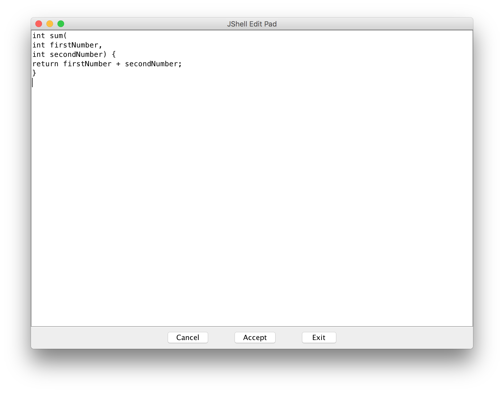
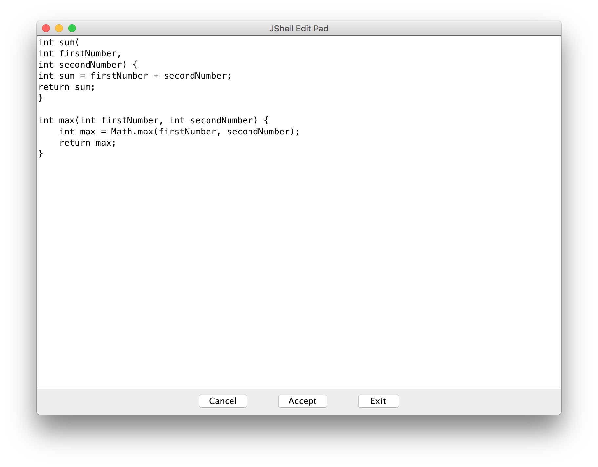
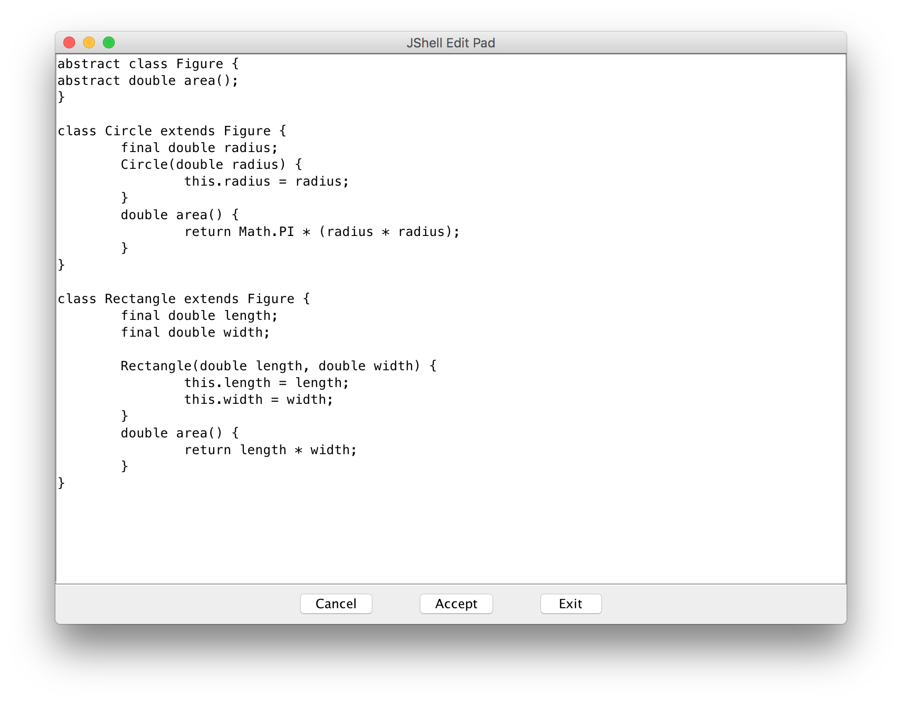

# JShell aka Java 9 REPL
Hakan Özler
:experimental:
:toc: macro
:toc-title: İçerik

JShell namıdiğer Java 9 REPL (http://openjdk.java.net/jeps/222[JEP 222]), Java 9 güncellemesiyle birlikte Java Platformuna katkı sağlayacak en önemli gelişmelerdendir. Java 9 ile birlikte eğitimsellik alanında önemli bir adım olarak görülmektedir. Java programlama dilini ve API özelliklerini kolayca keşfetmek, araştırmak ve deneyimlemek adına güçlü bir ortam sağlamaktadır. Geleneksek yöntemlerle Java kodlarını denemek için oluşturulan küçük projeler yerine JShell üzerinden Java kodlarını JShell'in sağladığı komut yordamlarıyla testini sağlayabiliyoruz. Etkileşimli olarak JShell oturumlarında girilen komutlar direkt JShell tarafından okunur (read), değerlendirilir (eval), değerlendirmeden ve analizden geçen kod ifadelerinin sonucu görüntülenir (print) ve tekrar bu prosedürlerin gerçekleşmesini sağlar (loop). Her defasında yapılan düzenleme, derleme ve çalıştırma işelemleri JShell ile birlikte yerini read-eval-print-loop döngüsüne bırakmıştır.

JShell kullanımıyla Java deneyimini arttırabileceğimiz gibi, daha hızlı öğrenmek ve yazılım geliştirmek aşamlarında hız kazanmak için de önemli bir ortam olarak görmekteyim. Java programlama dilinde bir proje oluşturup yazılan "Hello World":

[source,java]
----
public class Hello {
    public static void main(String[] args) {
      System.out.println("Hello World");
    }
}
----

JShell ortamında yerini:

----
$ jshell
jshell> System.out.println("Hello World")
Hello World

----

ile almaktadır. Tek satırdan oluşan ifadelerin sonuna noktalı virgül `;` koyulmasına gerek görülmemektedir. 

JShell üzerinde metod oluşturumları sınıf içerisinde yapılmasına gerek yoktur. Değişken tanımlamaları ve ifade oluşturumları metodlar içerisinde olması zorunluluğu olmamaktadır. Yukarıda da gördüğünüz gibi kod parçalarını çalıştırmak için statik `main` metod istenmemektedir. Bu aşamaları geride bırakarak kodlama işlemlerini hızlandırıp sadece istediğimiz konuya odaklanmamız sağlanır. Bu özelliklerinin dışında JShell kapsamlı bir yazılım geliştirme ordamı değildir. Amacı, önceki söylediklerime ek olarak, bir shell'in sağladığı yetenekleri bünyesinde barındırarak Java API özelliklerine doğrudan erişerek özellikleri hızlıca deneme, karşılaşılan Java hatalarını test etme ve algoritmalar geliştirme ortamıdır.    

toc::[]

#### {counter:index}. JShell komutlarının kullanımı

Farklı komut yordamlarını kullanarak kategörilere göre ifadeleri listeyebiliyoruz. Örneğin, import tanımlamaları için `/imports`, tip tanımlamaları için `/types`, değişken tanımalalarını görmek için `/vars` ve metod tanımlamaları için `/methods` yordamlarını ayrıca kullanabiliriz. Bu ve diğer komutların ön eklerini kullanarak da yordamları tetikleyebiliyoruz. Örneğin, `/imports`, `/import`, `/impor` ,`/impo`, `/imp`, `/im` ve `/i` aynı talebi istememizi sağlıyor. Girilen komutlar sistemde tek olduğundan aynı istek tüm varyasyonlarında döndürülüyor. Eğer sistemde aynı ön ek ile başlayan başka komutlar varsa, aşağıdaki gibi bir belirsizlik ile karşılaşabiliyoruz:

----
$ jshell  <1>
|  Welcome to JShell -- Version 9
|  For an introduction type: /help intro

jshell> /r
|  Command: '/r' is ambiguous: /reset, /reload
|  Type /help for help.
----  
1. Java 9 kurulumu için ana sayfadaki kurum başlığına bakabilirsiniz.

Komutlar hakkında daha detaylı bilgi almak için `/help` ön komutuyla birlikte bilgi almak istenen komutun ismi belirtilmelidir.

----
jshell> /help list
|
|  /list
|
|  Show the source of snippets, prefaced with the snippet id.
|
|  /list
|   List the currently active snippets of code that you typed or read with /open
|
|  /list -start
|   List the automatically evaluated start-up snippets
|
|  /list -all
|   List all snippets including failed, overwritten, dropped, and start-up
|
|  /list <name>
|   List snippets with the specified name (preference for active snippets)
|
|  /list <id>
|   List the snippet with the specified snippet id

jshell> /help imports
|
|  /imports
|
|  List the current active jshell imports.
---- 

### {counter:index}. Snippet ID

JShell oturumunda kayit altına alınan snippet özelliği taşıyan tüm ifadelerin (sınıf tanımla, matematik operasyonlar, import adımları vb) özel snippet numaraları olmaktadır. Bu numaralar üzerinden istenen ifadelere ulaşım sağlanabilir ve çalıştırılabilirler.

### {counter:index}. JShell session boyunca oluşturulan snippet kayıtlarını görmek

JShell oturumun boyunca erişilebilir tüm snippet adımlarına `/list` komutunu kullanarak ulaşabiliyoruz. Listede gözükenlerin kaçıncı adımda oluşturulduğu ya da güncellendiğini gösteren endeks numaralarıyla (snippet id) birlikte tutulmaktadır. Kullanılabilir tanımlı parçanın takibi çıkan liste içerisinde yapılabiliyor. Oturum süresince eğer aynı tanımlama birden fazla uygulanırsa, son yapılan tanımlama snippet numarasıyla listede gösteriliyor. Bu yaklaşım `/list` komutunun varsayılan yaklaşımıdır. Ekstra seçeneklerden `-all` `/list` ile birlikte uygulanırsa, oturum süresince düşürülmüş ve gizlenmiş diğer tüm parçalar da gösteriliyor. Başlangıçta dikkate alınan import adımları da dahil olmaktadır. Yapılan her matematiksel ifadeler (bu ifadeler aynı da olsalar) her zaman farklı id numaralarına sahip olmaktadırlar. Java üye (sınıf, arayüz, method, değişken vb) tanımlamalarında ise sadece en aktif erişilebilir tanımlamalar `/list` üzerinden gösterilmektedir.

### {counter:index}. JShell üzerinde yapılan tüm geçmişi listeme

JShell üzerinde oturumumuz açılmasıyla birlikte çalıştırdığımız komutları ve tanımlanan/işlenen kod parçalarının listesini `/list -history` komutunu çalıştırarak görebiliyoruz. Farklı liste komutlarıyla çıktılanan adımları dışa aktararak kalıcılaştırabiliyoruz. Dışa aktarılan kod parçalarını da JShell oturumlarında tekrar  kullabilmek adına içeri aktarabiliyoruz. 

### {counter:index}. JShell içerisinde spesific bir kod parçasını arayabilmek

`/list <id>` kalıbını kullanarak oturum boyunca yapılan bir kaydın detayına ulaşabiliyoruz. Örneğin; `/list 4` sorgusuyla numarası 4 olan snippet detayını bize döndürür. Oturumda bulunmayan geçersiz bir değer girildiğinde bize hata döndürülür.

### {counter:index}. Önceden yapılmış bir snippet ifadesini tekrar çalıştırmak

Bir önceki başlıkta istediğimiz bir ifadeye nasıl ulaşabildiğimizi öğrenmiştik. Bu ifadeyi bulmak için snippet numarasını belirterek ulaşabiliyorduk. Bu ifadenin içeriğine bakıp tekrar çalıştırma kararı alırsak eğer tek yapmamız gereken adım komut satırına bu ifadenin numarasını belirtip çalıştırmak olacaktır. Örneğin 4. snippeti tekrar çalıştırmak istersek, `/4` girerek çalıştırmalıyız. Bu yaklaşımı uygulamamız sonucunda `/list` akışında bir değişiklik gözlemlenmez. 

### {counter:index}. Hata yaptığımız parçaların kayıt listesi

Hata yapılan ifadeler başında "e" ön eki olan ve oturumda toplam hata sayısının bir fazlası gelecek şekilde değer eklenerek arka planda bir değişkene ayarlanıyor. Örneğin; değişkeni tanımlamadan bir sayıya eşitlediğimizde bunu, `degree = 50`, degree degiskenin tip değerinin bulunamadığı belirtilir ve bu eğer bizim oturumumuzda ilk hatamız olacak ise "e1" biçiminde bir değişkene atanır. Bu kaydı `/list -all` komutu üzerinden görebilirsiniz. 

### {counter:index}. Kullanıcı ve JShell yönetimli değişken oluşturma ve kullanımı

Dolaylı yolla ya da doğrudan oluşturulan değişkenlerin bazılarını başka değişkenler ile kullabiliyoruz. Örneğin, bu değişken bir Java değişkeni veya aritmatik ifade olabilir. Aşağıdaki örneklememizde, `world` isminde `String` değer taşıyan bir Java değişkeni ile farklı değişkenler oluşturabildiğimiz gibi aritmetik ifadenin değişkeni üzerinden farklı değişken kullanımlarını düzenleyebiliyoruz.   

----
jshell> String world = "world"  <1>
world ==> "world"

jshell> "hello" + world     <2>
$2 ==> "helloworld"

jshell>  world + $2         <3>
$3 ==> "worldhelloworld"

jshell>  world + "." 
$4 ==> "world."

jshell> String.join(" ", "hello", $4) <4>
$5 ==> "hello world."

jshell> $5 + $2
$6 ==> "hello world.helloworld"

jshell> 4 + 1      <5>
$7 ==> 5

jshell> 6 + $7
$8 ==> 11
----   
1. Kullanıcı tanımlı `String` tipinde `world` değişkeni oluşturuyoruz.
2. Başka bir `String` ifadeyi `world` değişkeniyle birleştirelim. Bu birleştirme ile JShell yönetimli değişken oluşturulması gerçekleşecek. İstenen değere ulaşmak için JShell `$2` üzerinden erişilebileceğini söylemektedir.
3. Kullanıcı tanımlı ve JShell tanımlı değişkenleri birleştiriyoruz.
4. Java 8 ile gelen `join` statik metodu kullanarak bu sefer birden fazla değeri birleştirme işlemi yapalım. Bu tanımlamalar için hep JShell yönetimli değişkenler oluşturulduğunu göreceksiniz.
5. Son olarak matematik işleminin de sonucunu ayrı bir değişken oluşturulup atandığını görmekteyiz.

### {counter:index}. JShell oturumunu yeniden başlatmak

Oturumu boyunca kayıt altına alınan tüm kod parçalarını sıfırlayarak yeni ve temiz bir oturum elde edebiliyoruz. `/reset` komutunu kullanılarak tüm snippet kayıtları silinir, başlangıçta rol oynayan adımlar tekrardan çalıştırılır ve JShell dışına çıkmadan ilk giriş sağladığımız duruma tekrar ulaşırız.  

----
jshell> /reset
----

### {counter:index}. JShell oturumunda birden fazla satır kullanabilme

Eğer ifade tanımlamanızda parantez ya da süslü parantez kullanımı varsa ve aynı satırda açılıyor ama kapanmıyorsa, bir sonraki satıra geçildiğinde 3 nokta (...) ile ifadenin devamında yazılacaklar beklenecektir. Aşağıdaki örneğimizde `sum` isminde 2 parametreden oluşacak bir metod yazalım. Metodun parametrelerini ve aynı zamanda metod gövdesini  okunabilirlik açısından ayrı satırlarda girerek toplam 5 satırda metodu tanımlamış oluyoruz. 

----
jshell> int sum(
   ...> int firstNumber,
   ...> int secondNumber) {
   ...> return firstNumber + secondNumber;
   ...> }
|  created method sum(int,int)

jshell> 12  <1>
$10 ==> 12

jshell> 4
$11 ==> 4

jshell> System.out.print(sum($10,$11))
16
----
1. İfade olarak tek bir değer girişi yaparsak, JShell *yönetimli* özel değişken ismi oluşturulur ve bu değişken ismi üzerinden oturum süresince tekrar tekrar değer kullanılabilir.

### {counter:index}. Tanımladığımız ifadeleri düzenleme

Tek satırdan oluşan tanımlamaların tekrar düzenlenmesi komut satırı üzerinde problem olmamakta fakat birden fazla satırdan oluşan tanımlamaları tek satırda düzenlemek işkenceye dönebilir. JShell içerisinde gelen bir diğer komut sayesinde bir veya birden fazla satırdan oluşan ifadeleri düzenleyebiliyoruz. `/edit` komutu bu amaç için kullanılmaktadır. Bunun için bir snippet id numarası ya da ona referans gosterilen isimlendirme üzerinden ilgili parçayı belirtmemiz gerekiyor. Ayrıca son kayıt altına alınan tanımı da parametre girmeden `/edit` komutuyla güncelleyebiliyoruz. Eğer kendimiz farklı bir editor daha öncesinden belirlemediysek varsayılan olarak belirlenen editor üzerinden düzenleme imkanımız oluyor. JShell konfigürasyonunu nasıl değiştirebileceğimizi de alt bölümlerde ele alacağız. Gelin oluşturduğumuz `sum` metodunu düzenleyelim.

----
jshell> /edit sum <1>
---- 
1. isteği ilettiğimizde karşımıza metod tanımını gösteren aşağıdaki editor açılacak.

Editörde `sum` metodunun gövdesini biraz değiştirip ayrıca yeni bir metod eklemek isteyelim. Bu metodumuz da gene 2 parametreden oluşsun ve bize bu değerler ışığından maksimum olan sayıyı döndürsün. Aşağıdaki resim ile editörde yapmak istediklerimizi somut olarak görmekteyiz.

Resimde dikkatinizi çekecek olan 3 buton bulunuyor. `Cancel` seçeneğini seçersek editördeki düzenlemelerimiz kalıcılaşmadan kaybolur.  `Accept` seçeneğini seçerek editördeki tanımlamaların analizi yapılıp istenenlerin çalıştırılması sağlanır. `Exit` seçeneği `Accept` ile aynı özelliği taşımaktadır, tek farklı, mevcut editörün kullanımı sonlanır. 

Editörde güncellediğimiz `sum` metodu ve yeni oluşturduğumuz `max` metodunu onaylayalım ("Accept"). JShell konsolunda bir değişiklik olacak mı gözlemleyelim. Eğer sizde bu aşamaları yaıyorsanız aşağıdaki çıktıyı aldığımızı siz de göreceksiniz. Küçük bir tavsiye adına, ister editörde ister JShell konsolu üzerinde olun, satır başı yaparak ifadeleri yazmayı ihmal etmeyin. Bu yöntemle kod parçalarını daha kolay anlayıp güncelleyebilirsiniz. Örneğimizde `max` metodunda bunu uygulamaya çalıştım.  

----
|  modified method sum(int,int)
|  created method max(int,int)
----

Onayladığımızda `sum` metodunun güncellendiğini ve `max` metodunun oluşturulduğunu görmüş olduk.  Ayrıca çıkış yaparak son adımda değerlendirilen kodları `/list -all` ile inceleyebiliriz. Bu komut haricinde sadece tanımlı metodların imza tanımlamalarıyla listelemek için `/methods` komutunu kullanabiliyoruz.

----
jshell> /list -all
  ...
  ...
  17 : int sum(
       int firstNumber,
       int secondNumber) {
       int sum = firstNumber + secondNumber;
       return sum;
       }
  18 : int max(int firstNumber, int secondNumber) {
           int max = Math.max(firstNumber, secondNumber);
           return max;
       }

jshell> /methods
|    int sum(int,int)
|    int max(int,int)

jshell> max(2,6)
$4 ==> 6
----

### {counter:index}. JShell oturumundan çıkma işlemi :(

JShell oturumundan çıkmak için 2 farklı yol bulunmakta 

1. `/exit` ya da daha kısa haliyle aynı işlemi gören `/ex` komutuyla ya da
2. CTRL + C + D kısayolunu kullanılarak çıkış yapılabilir.

### {counter:index}. Tip yaratma ve listeleme

JShell üzerinden birkaç tane tip tanımlaması yapalım ve bunların listenme işlemine bakalım. Öncelikle `Figure` isminde bir soyut sınıf oluşturuyoruz. Bu işlemi JShell üzerinden ayarlayıp sonrasında bu sınıfı editör üzerinden düzenlemek için açalım. Aslında amacım yeni oluşturduğumuz sınıfı güncellemek değil, amacım editör kolaylığını seçerek diğer somut sınıfları oluşturmaktır.

----
jshell> abstract class Figure {
   ...> abstract double area();
   ...> }
|  created class Figure

jshell> /edit Figure
----

Editörün yardımıyla 2 yeni somut sınıf tanımlamış olduk. Bu somut sınıflar soyut `Figure` sınıfını genişletiyor. Editörde girilen yapıların analizinin yapılıp değerlendirilmesini istiyoruz sonrasında editörden çıkıyoruz.

.onaylama sonrasında konsola çıktılanan bildirimler.
----
|  created class Circle
|  created class Rectangle
----

`/types` komutunu ya da ön eklerini uygulayarak oturumda kullanilabilen mevcut tip (sınıf, arayüz ve enum) leri listeleyebiliriz:

----
jshell> /types
|    class Figure
|    class Circle
|    class Rectangle
----

Spesific bir tip tanımını da arayabiliyoruz:

----
/types Circle
|    class Circle

----

### {counter:index}. Referans tipte değişkenler ve nesneler oluşturma

Tıpkı primitive değişkenler oluşturabildiğimiz gibi sınıf nesneleri oluşturabiliyoruz. Önceki örneklerimizde bu yaklaşımın yapılabildiğini String tipinde bazı değişkenler yaratarak görmüştük. Bir önceki görevimizde oluşturduğumuz `Circle` ve `Rectangle` sınıflarından değişkenler oluşturup, oluşturulan değişkenlerden nesneler yaratabiliriz. Kısaca bunlarla ilgili adımları yapaım:

----
jshell> Circle circle <1>
circle ==> null

jshell> circle
circle ==> null

jshell> circle = new Circle(2)
circle ==> Circle@490ab905 <2>

jshell> new Circle(4) <3>
$4 ==> Circle@72d818d1
----
1. Default null değerini alacak olan sonuna noktalı virgül koymadan oluşturduğumuz referans tip değişkenimiz
2. `circle` değişkenimizi oluşturduktan sonra Circle sınıfından oluşturacağımız nesneyi bu değişkene referans verebiliriz. İşlem sonrasında nesnemizin string kimlik değerini görüyoruz.
3. İstersek referans tanımlamasını JShell'e bırakarak yeni bir Circle nesne değişkeni elde edebiliriz.  

Oluşturulan ilk immutable nesneyi çalıştırıp sonucumuza ulaşalım son olarak:

----
jshell> circle.area()
$16 ==> 12.566370614359172 <1>
----
1. danss

Unutmadan söylemek istiyorum, eğer biz `circle.area()` metodunu defalarca koşturusak, her dönen değer için JShell yönetimli bir değişken yaratılmış olur. Fakat metodu `print` komutunda çağırırsak bu dolaylı tanımlama yolu yapılmamış olur.

----
jshell> System.out.print(circle.area())
12.566370614359172 <1>
----
1. Görüldüğü gibi her hangi bir özel değişkene atama yapılmadan sadece sonuç değeri çıktılanmış oldu.

### {counter:index}. Kullanılabilir kod parçalarını içe ve dışa aktarma özelliği

JShell oturumu boyunca kaydettiğimiz, güncellediğimiz ve çalıştırdığımız tüm adımları dışa aktararak kalıcılaştırma imkanımız bulunuyor. Daha sonrasında dışa aktarılan değerlerin hepsini farklı oturumlarda tekrar aynı adımları yapmamak adına içe aktararak aynı değerlere ulaşabilmemiz de mümkündür. JShell konsolu üzerinde hem içe hem dışa ve ayrıca Java kod parçalarını içe aktarmaya birlikte bakalım: 

----
jshell> /list <1>

   1 : abstract class Figure {  <2>
       abstract double area();
       }

jshell> /save snippets <3>
jshell> /ex
|  Goodbye
$ pwd
/Users/hakan/jshell-examples  
$ ls                <4>
snippets   Circle.java    Rectangle.java
$ jshell
|  Welcome to JShell -- Version 9
|  For an introduction type: /help intro

jshell> /open snippets  <5>

jshell> /list           <6>

   1 : abstract class Figure {
       abstract double area();
       }

jshell> /open Circle.java  <7>

jshell> /types             <8>
|    class Figure
|    class Circle

jshell> /open Rectangle.java  <9>

jshell> /list                 <10>

   1 : abstract class Figure {
       abstract double area();
       }
   2 : class Circle extends Figure {
           final double radius;
           Circle(double radius) {
               this.radius = radius;
           }
           double area() {
               return Math.PI * (radius * radius);
           }
       }
   3 : class Rectangle extends Figure {
           final double length;
           final double width;

           Rectangle(double length, double width) {
               this.length = length;
               this.width = width;
           }
           double area() {
               return length * width;
           }
       }

jshell> /types    
|    class Figure
|    class Circle
|    class Rectangle
----
1. Öncelikle oturumumuzda hangi snippet adımları bulunuyor bunlara bakalım.
2. `Figure` isminde soyut sınıfımızın tanımını görmekteyiz.
3. Oturumdaki tanımlamaları `snippets` isminde bir dosya içerisinde kaydedilmesini istiyoruz. Bu adımda `/save` komutu bizim ihtiyacımızı karşılıyor. `snippets` dosyası bulunduğumuz çalışma dizinine kaydedilir.
4. Oturumundan çıktıktan sonra bulunduğumuz dizini gözlemlediğimizde `snippets` dosyası bizi selamlıyor. Ayrıca 2 `java` uzantılı da dosyamız bulunuyor bu dizinde.
5. Tekrar yeni bir JShell oturumu açtıktan sonra kaydedilen değerleri içe aktaralım. Bu işlemi gerçekleştirmek için `/open` komutunu kullanmamız gerekiyor. Bu komut ile birlikte bulunduğumuz dizinde olan `snippets` dosyasının ismini giriyoruz. 
6. Listeleme işleminden sonra somut sınıfımız olan `Figure` eklenmiş olarak karşımıza geliyor.
7. Şimdi gelin önceden JShell üzerinden editörde eklediğimiz sınıfları bu sefer dosya dizinimizden ekleyelim. `Circle.java` ve `Rectangle.java` dosyalarını içe aktaralım. `/open` komutu jshell adımlarını içeri aktarılmasına yardımcı olduğu gibi farklı Java tanımlamalarını da içeri aktarmamızı sağlıyor. `Circle` sınıfımız `Figure` sınıfını genişletmesinden dolayı oturumumuzda öncesinde `Figure` soyut sınıfın tanımlanmış olmasını bekliyoruz. Eğer `Figure` sınıfı olmadan `Circle` sınıfını içeri aktarırsak, `Figure` sınıfının tanımının yapılmadan `Circle` sınıfından nesne oluşturulamayacağını bize söyler.
8. İçe aktarımdan sonra tüm tanımlı tipleri listelemek istediğimizde `Figure` ve `Circle` sınıflarını görmekteyiz.
9. Ardından `Rectangle` sınıfını da oturumun içine aktaralım.
10. Aktarımlardan sonra tüm adımların detaylı görünümüne bakalım.

### {counter:index}. Otomatik tamamlama özelliği

Varsayılan olarak JShell üzerinde otomatik tamamlama özelliği bulunmaktadır. Örneğin `Recta` yazıp <tab> yaptığımızda eğer birden fazla seçenek bulunmazsa bulunan tek seçenek ile otomatik olarak tamamlanır. Bu işlemleri komutlar için yapabiliriz, JShell üzerinde ulaşılabilen ve tanınan tüm ifadeler için gerçekleştirebiliyoruz. Aşağıdaki örneklemelere göz atabilirsiniz. `<tab>` tuşuna basarak bu adımları sizler de deneyebilirsiniz.

----
jshell> /re <tab>
/reload    /reset

jshell> /re

jshell> Recta <tab>
Rectangle

jshell> Rectangle

jshell> Stream <tab>
Stream                     StreamCorruptedException   StreamSupport              StreamTokenizer

jshell> Rectangle rec = new Rectangle(3,2)
rec ==> Rectangle@1ce92674

jshell> re <tab>
rec

jshell> rec

jshell> rec. <tab>  <1>
area()        equals(       getClass()    hashCode()    length        notify()      notifyAll()   toString()    wait(         width

jshell> circ <tab> <2>
jshell> circ

jshell> Circ <tab> <3>
Circle

jshell> Circle
----  
1. Nokta `.` ekleyip nesnenin elemanlarına ulaşabiliyoruz. Örneğin parametre almayan metodların `()` şeklinde sonlandığının görebiliyoruz. Parametre alan metodlar `(` tek parantez açık olarak gözükürler. Ayrıca değişkenlere de direkt olaşabiliyoruz ve atanan değerlere erişebiliyoruz.
2. `circ` yazıp <tab> uyguladığımızda bir değişlik olmuyor.
3. `Circ` yazıp tekrar <tab> yaptığımızda tanımlı `Circle` sınıfına girdiğimiz kısım tamamlanmış olarak karşımıza geliyor. Büyük küçük harfe duyarlı bir tamamlama özelliği bulunmaktadır.

### {counter:index}. Detay bilgi alma aşamaları

JShell birden fazla `<tab>` aşamasıyla detaylı bilgi elde etme imkanı sunuyor. Bu aşamaları Java tanımlamalarına ve JShell sorgu yapılarına uygulayabiliyoruz. Aşamalarla istenen bilgilere nasıl ulaşıldığını inceleyelim:

----
jshell> /re       <1>
/reload    /reset

jshell> /re         <2>
/reload    /reset

<press tab again to see synopsis>

jshell> /re     <3>
/reload
reset and replay relevant history -- current or previous (-restore)

/reset
reset jshell

<press tab again to see full documentation>

jshell> /re         <4>
/reload
Reset the jshell tool code and execution state then replay each valid snippet
and any /drop commands in the order they were entered.

/reload
    Reset and replay the valid history since jshell was entered, or
    a /reset, or /reload command was executed -- whichever is most
    recent.

/reload -restore
    Reset and replay the valid history between the previous and most
    recent time that jshell was entered, or a /reset, or /reload
    command was executed. This can thus be used to restore a previous
    jshell tool session.

/reload [-restore] -quiet
    With the '-quiet' argument the replay is not shown.  Errors will display.

Each of the above accepts context options, see:

    /help context

For example:

    /reload -add-modules com.greetings -restore

<press tab to see next command>

jshell> /re         <5>
/reset
Reset the jshell tool code and execution state:
    * All entered code is lost.
    * Start-up code is re-executed.
    * The execution state is restarted.
    Tool settings are maintained, as set with: /set ...
Save any work before using this command.
The /reset command accepts context options, see:

    /help context

jshell> /re
----
1. İlk olarak `/re` komutunu otomatik tamamlatmak isteyelim. `/re` ve <tab> yaptığımızda, JShell bize `/re` ön ekiyle başlayan 2 farklı komut olduğunu söyleyecek. 
2. Tekrar aynı kalıba <tab> yaptığımızda öncekinden farklı olarak `<press tab again to see synopsis>` detayını görmüş olacaksınız. Durum ilginçleşiyor :) 
3. Tekrar tab yaptığımızda bağlantılı komutların kısa açıklamasını görürüz. Bu adım sonrasında da `<press tab again to see full documentation>` açıklaması gözümüze çarpıyor. Tab kullanımına devam ediyoruz :)
4. Tab komutuyla birlikte bağlantılı komutlardan ilki `reload` hakkında detaylı dokümantasyonu derleniyor. Detayın altındaki başka bir ifade daha olduğu görülüyor: `<press tab to see next command>`. `/re` ile ilgili bağlantılı komutumuz 2 tane vardı. 2. komuta dair detaylı bilgiye ulaşmak için gene bir <tab> daha yapmamız gerekiyor.
5. Yaptığımız son bir <tab> hamlesiyle `/reset` komutunun bilgilerine de ulaşmış oluyoruz. <tab> kullanarak JShell bizlere sınırlı ve kapsamlı bilgileri belirli aşamalarla sağladığını öğrenmiş olduk.

Oluşturduğumuz `Rectangle` nesnesine ait bir dokümantasyonumuz bulunmuyor ama bu nesne değişkeni üzerinden <tab> kullanımıyla sınıfa ait dokümantasyon sorgulaması yapabilmekteyiz.

----
jshell> rec
rec

Signatures:
rec:Rectangle

<press tab again to see documentation>

jshell> rec
rec:Rectangle
<no documentation found>

jshell> rec
----

Örneğin bir başka dokümantasyon örneğimiz JDK 9 ile gelecek olan Collections çatısında yerini alacak yeni factory metodlardan `List.of` metodu olsun. Bu metodu kullarak sonrasınra değiştirilemeyecek bir liste elde edebiliyoruz. Farklı tab adımlarıyla  bu metoda ait tüm bilgilere sahip olabiliyoruz.

----
jshell> List.o   <tab>
of(

jshell> List.of(  <tab>
Signatures:
List<E> List<E>.<E>of()
List<E> List<E>.<E>of(E e1)
List<E> List<E>.<E>of(E e1, E e2)
List<E> List<E>.<E>of(E e1, E e2, E e3)
List<E> List<E>.<E>of(E e1, E e2, E e3, E e4)
List<E> List<E>.<E>of(E e1, E e2, E e3, E e4, E e5)
List<E> List<E>.<E>of(E e1, E e2, E e3, E e4, E e5, E e6)
List<E> List<E>.<E>of(E e1, E e2, E e3, E e4, E e5, E e6, E e7)
List<E> List<E>.<E>of(E e1, E e2, E e3, E e4, E e5, E e6, E e7, E e8)
List<E> List<E>.<E>of(E e1, E e2, E e3, E e4, E e5, E e6, E e7, E e8, E e9)
List<E> List<E>.<E>of(E e1, E e2, E e3, E e4, E e5, E e6, E e7, E e8, E e9, E e10)
List<E> List<E>.<E>of(E... elements)

<press tab again to see documentation>

jshell> List.of(  <tab>
List<E> List<E>.<E>of()
Returns an immutable list containing zero elements.See Immutable List Static Factory Methods
for details.

Type Parameters:
E - the List 's element type

Returns:
an empty List

<press tab to see next documentation>

jshell> List.of(  <tab>
List<E> List<E>.<E>of(E e1)
Returns an immutable list containing one element.See Immutable List Static Factory Methods for
details.

Type Parameters:
E - the List 's element type

Parameters:
e1 - the single element

Returns:
a List containing the specified element

Thrown Exceptions:
NullPointerException - if the element is null

<press tab to see next documentation>

jshell> List.of( <tab> <1>  
----
1. Toplamda `List.of` 12 overload metodu bulunmaktadır. `tab` adımlarını 10 kez daha tekrar ederek diğer overloaded metodların dokümantasyonlara ulaşabiliriz.

Slash `/` ve <tab> kombinasyonuyla kullanılabilir mevcut komutları görebiliyoruz:

----
jshell> /
/!          /?          /drop       /edit       /env        /exit       /help       /history    /imports    /list       /methods    /open       /reload     /reset      /save       /set        /types
/vars
----

### {counter:index}. `/!` ve `/-` kullanımı

`/!` komutu ile bir önceki çalıştırılan ifadeyi tekrar çalıştırmamız sağlanır.

----
jshell> Math.random()
$8 ==> 0.1891103887126322

jshell> /!
Math.random()
$9 ==> 0.5946399311904251
----

`/-{N}` komutunu kullanarak çalıştırılan en çok N. ifadenin değerine ulaşırız. Çalıştırılması istenen N. adımı `/list -all` dökümünden dikkatle bakarsak, hangi komutun en çok kullanıldığını ve bunun hangi ifade olacağını gözlemlemiş oluruz. 

----
$ jshell
|  Welcome to JShell -- Version 9
|  For an introduction type: /help intro

jshell> int degree = 44
degree ==> 44

jshell> String city = "Izmir"
city ==> "Izmir"

jshell> city
city ==> "Izmir"

jshell> city
city ==> "Izmir"

jshell> city
city ==> "Izmir"

jshell> /list -a

  s1 : import java.io.*;
  s2 : import java.math.*;
  s3 : import java.net.*;
  s4 : import java.nio.file.*;
  s5 : import java.util.*;
  s6 : import java.util.concurrent.*;
  s7 : import java.util.function.*;
  s8 : import java.util.prefs.*;
  s9 : import java.util.regex.*;
 s10 : import java.util.stream.*;
   1 : int degree = 44;
   2 : String city = "Izmir";
   3 : city
   4 : city
   5 : city

jshell> /-1     <1>
city
city ==> "Izmir"
----
1. JShell oturumunu başlattıktan sonra `int` veri tipinde değeri 44 olan bir `degree` değişkeni oluşturduk. Sonrasında `String` tipinde değeri "İzmir" olan `city` değişkenini oluşturmuş olduk. Sonrasında `city` değişkenini 3 kez çalıştırma işlemini gerçekleştirdik. Tüm listeyi sorguladığımızda da bu eylemin ağaçtaki adımlarını görebiliyoruz. `/-1` komutunu çalıştırarak en çok kullanılan komutun yani `city` değişkeninin çalıştırılmasını tetiklemiş oluyoruz.

